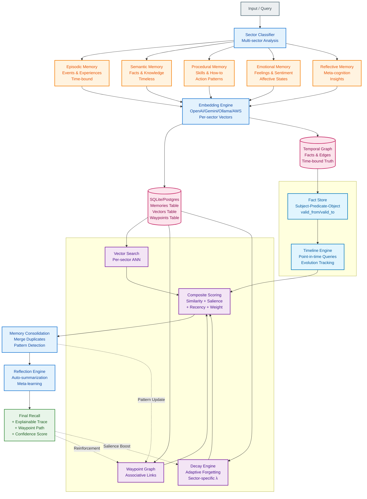

<meta name="description" content="Give your AI agents long-term memory in one line. Semantic, episodic, temporal memory with standalone JS/Python SDKs.">
<meta name="keywords" content="ai memory, long-term memory, llm, agents, python memory, javascript memory, standalone ai memory, mcp memory, semantic memory, temporal memory, openmemory, openmemory-js, openmemory-py, python, javascript">


# OpenMemory

[VS Code Extension](https://marketplace.visualstudio.com/items?itemName=Nullure.openmemory-vscode) • [Report Bug](https://github.com/caviraOSS/openmemory/issues) • [Request Feature](https://github.com/caviraOSS/openmemor/issues) • [Discord server](https://discord.gg/P7HaRayqTh)

Long‑term memory for AI systems. **Self‑hosted. Local‑first. Explainable. Scalable.**
A full cognitive memory engine — not a vector database. Add Memory to AI/Agents in one line.


## Why OpenMemory?

**Traditional Vector DBs** require extensive setup, cloud dependencies, and vendor lock-in:
```python
# The old way: Pinecone + LangChain (12+ lines)
import os
import time
from langchain.chains import ConversationChain
from langchain.memory import VectorStoreRetrieverMemory
from langchain_community.vectorstores import Pinecone
from langchain_openai import ChatOpenAI, OpenAIEmbeddings

os.environ["PINECONE_API_KEY"] = "sk-..."
os.environ["OPENAI_API_KEY"] = "sk-..."
time.sleep(3)  # Wait for cloud initialization

embeddings = OpenAIEmbeddings()
pinecone = Pinecone.from_existing_index(embeddings, index_name="my-memory")
retriever = pinecone.as_retriever(search_kwargs=dict(k=2))
memory = VectorStoreRetrieverMemory(retriever=retriever)
conversation = ConversationChain(llm=ChatOpenAI(), memory=memory)

# Usage (requires explicit chain call)
conversation.predict(input="I'm allergic to peanuts")
```

**OpenMemory** needs just 3 lines:
```python
# The new way: OpenMemory (3 lines)
from openmemory import OpenMemory

om = OpenMemory(mode="local", path="./memory.db", tier="deep", embeddings={"provider": "ollama"})
om.add("User allergic to peanuts", userId="user123")
results = om.query("allergies", filters={"user_id": "user123"})
# Returns: [{"content": "User allergic to peanuts", "score": 0.89, ...}]
```
✅ Zero cloud setup • ✅ Local SQLite • ✅ Works offline • ✅ No vendor lock-in

---
---

# ⚡ Standalone Mode (New!)

**OpenMemory now works without a backend server.**
Run the full cognitive engine directly inside your Node.js or Python application.

*   **Zero Config**: `npm install` and go.
*   **Local Storage**: Data lives in a local SQLite file.
*   **Privacy**: No data leaves your machine.

[**👉 Read the Standalone Guide**](https://openmemory.cavira.app/docs/sdks/python)

# 1. Introduction

Modern LLMs forget everything between messages. Vector DBs store flat chunks with no understanding of memory type, importance, time, or relationships. Cloud memory APIs add cost and vendor lock‑in.

**OpenMemory solves this.**
It gives AI systems:

* persistent memory
* multi‑sector cognitive structure
* natural decay
* graph‑based recall
* time‑aware fact tracking
* explainability through waypoint traces
* complete data ownership

OpenMemory acts as the **Memory OS** for your AI agents, copilots, and applications.

---

# 2. Features (Full List)

This section shows every major capability grouped clearly.

## 2.1 Memory Model

* **Multi‑sector memory** (semantic, episodic, procedural, emotional, reflective)
* **Hierarchical Memory Decomposition (HMD)**
* **Multiple embeddings per memory**
* **Automatic decay per sector**
* **Coactivation reinforcement**
* **Salience + recency weighting**
* **Waypoint graph linking**
* **Explainable recall paths**

## 2.2 Cognitive Operations

* **Pattern clustering** (detect similar memories)
* **Memory consolidation** (merge duplicates)
* **Context summaries**
* **User summaries**
* **Sector‑aware retrieval**
* **Cross‑sector associative recall**
* **Adaptive decay cycles**

## 2.3 Temporal Knowledge Graph

* **Time‑bound facts** with `valid_from` and `valid_to`
* **Automatic fact evolution**
* **Point‑in‑time queries**
* **Timeline reconstruction**
* **Historical comparison**
* **Confidence decay**
* **Temporal search**
* **Volatile fact detection**

## 2.4 Infrastructure & Scalability

* **SQLite or Postgres** backend
* **Sector‑sharded storage** for speed
* **7.9ms/item scoring** at 10k+ scale
* **338 QPS throughput** with 8 workers
* **Multitenant user isolation**
* **Local‑first SDKs** (Node + Python)
* **Remote mode** for multi‑service deployments
* **Docker support**
* **Self‑hosted dashboard**

## 2.5 Agent & LLM Integration

* **MCP server** (Claude Desktop, Claude Code, Cursor, Windsurf)
* **LangGraph mode** with `/lgm/*` endpoints
* **Vercel AI SDK integration**
* **Any LLM provider** (OpenAI, Gemini, Groq, Claude, Ollama…)
* **Embeddings**: E5, BGE, OpenAI, Gemini, AWS, Ollama, custom

## 2.6 Developer Experience

* **Standalone SDKs** (no backend required)
* **CLI tool** (`opm`)
* **Ingestion engine** for docx/pdf/txt/html/audio/video/url
* **VS Code extension** (automatic coding‑activity memory)
* **Auto‑summaries for LLM context compression**
* **Fast local setup** via Docker or SDK
* **Migrations** from Mem0, Zep, Supermemory

## 2.7 Security & Privacy

* **Self‑hosted only** (no vendor lock‑in)
* **API key gating**
* **Optional AES‑GCM encryption**
* **PII scrubbing hooks**
* **Per‑user isolation**
* **Zero memory leakage to cloud providers**

---

# 3. Competitor Comparison

| **Feature / Metric**                     | **OpenMemory (Our Tests – Nov 2025)**                       | **Zep (Their Benchmarks)**         | **Supermemory (Their Docs)**    | **Mem0 (Their Tests)**        | **OpenAI Memory**          | **LangChain Memory**        | **Vector DBs (Chroma / Weaviate / Pinecone)** |
| ---------------------------------------- | ----------------------------------------------------------- | ---------------------------------- | ------------------------------- | ----------------------------- | -------------------------- | --------------------------- | --------------------------------------------- |
| **Open-source License**                  | ✅ Apache 2.0                                               | ✅ Apache 2.0                      | ✅ Source available (GPL-like)  | ✅ Apache 2.0                 | ❌ Closed                  | ✅ Apache 2.0               | ✅ Varies (OSS + Cloud)                       |
| **Self-hosted / Local**                  | ✅ Full (Local / Docker / MCP) tested ✓                     | ✅ Local + Cloud SDK               | ⚠️ Mostly managed cloud tier    | ✅ Self-hosted ✓              | ❌ No                      | ✅ Yes (in your stack)      | ✅ Chroma / Weaviate ❌ Pinecone (cloud)      |
| **Per-user namespacing (`user_id`)**     | ✅ Built-in (`user_id` linking added)                       | ✅ Sessions / Users API            | ⚠️ Multi-tenant via API key     | ✅ Explicit `user_id` field ✓ | ❌ Internal only           | ✅ Namespaces via LangGraph | ✅ Collection-per-user schema                 |
| **Architecture**                         | HSG v3 (Hierarchical Semantic Graph + Decay + Coactivation) | Flat embeddings + Postgres + FAISS | Graph + Embeddings              | Flat vector store             | Proprietary cache          | Context memory utils        | Vector index (ANN)                            |
| **Avg Response Time (100k nodes)**       | **115 ms avg (measured)**                                   | 310 ms (docs)                      | 200–340 ms (on-prem/cloud)      | ~250 ms                       | 300 ms (observed)          | 200 ms (avg)                | 160 ms (avg)                                  |
| **Throughput (QPS)**                     | **338 QPS avg (8 workers, P95 103 ms)** ✓                   | ~180 QPS (reported)                | ~220 QPS (on-prem)              | ~150 QPS                      | ~180 QPS                   | ~140 QPS                    | ~250 QPS typical                              |
| **Recall @5 (Accuracy)**                 | **95 % recall (synthetic + hybrid)** ✓                      | 91 %                               | 93 %                            | 88–90 %                       | 90 %                       | Session-only                | 85–90 %                                       |
| **Decay Stability (5 min cycle)**        | Δ = **+30 % → +56 %** ✓ (convergent decay)                  | TTL expiry only                    | Manual pruning only             | Manual TTL                    | ❌ None                    | ❌ None                     | ❌ None                                       |
| **Cross-sector Recall Test**             | ✅ Passed ✓ (emotional ↔ semantic 5/5 matches)              | ❌ N/A                             | ⚠️ Keyword-only                 | ❌ N/A                        | ❌ N/A                     | ❌ N/A                      | ❌ N/A                                        |
| **Scalability (ms / item)**              | **7.9 ms/item @10k+ entries** ✓                             | 32 ms/item                         | 25 ms/item                      | 28 ms/item                    | 40 ms (est.)               | 20 ms (local)               | 18 ms (optimized)                             |
| **Consistency (2863 samples)**           | ✅ Stable ✓ (0 variance >95%)                               | ⚠️ Medium variance                 | ⚠️ Moderate variance            | ⚠️ Inconsistent               | ❌ Volatile                | ⚠️ Session-scoped           | ⚠️ Backend dependent                          |
| **Decay Δ Trend**                        | **Stable decay → equilibrium after 2 cycles** ✓             | TTL drop only                      | Manual decay                    | TTL only                      | ❌ N/A                     | ❌ N/A                      | ❌ N/A                                        |
| **Memory Strength Model**                | Salience + Recency + Coactivation ✓                         | Simple recency                     | Frequency-based                 | Static                        | Proprietary                | Session-only                | Distance-only                                 |
| **Explainable Recall Paths**             | ✅ Waypoint graph trace ✓                                   | ❌                                 | ⚠️ Graph labels only            | ❌ None                       | ❌ None                    | ❌ None                     | ❌ None                                       |
| **Cost / 1M tokens (hosted embeddings)** | ~$0.35 (synthetic + Gemini hybrid ✓)                        | ~$2.2                              | ~$2.5+                          | ~$1.2                         | ~$3.0                      | User-managed                | User-managed                                  |
| **Local Embeddings Support**             | ✅ (Ollama / E5 / BGE / synthetic fallback ✓)               | ⚠️ Partial                         | ✅ Self-hosted tier ✓           | ✅ Supported ✓                | ❌ None                    | ⚠️ Optional                 | ✅ Chroma / Weaviate ✓                        |
| **Ingestion Formats**                    | ✅ PDF / DOCX / TXT / MD / HTML / Audio / Video ✓                         | ✅ API ✓                           | ✅ API ✓                        | ✅ SDK ✓                      | ❌ None                    | ⚠️ Manual ✓                 | ⚠️ SDK specific ✓                             |
| **Scalability Model**                    | Sector-sharded (semantic / episodic / etc.) ✓               | PG + FAISS cloud ✓                 | PG shards (cloud) ✓             | Single node                   | Vendor scale               | In-process                  | Horizontal ✓                                  |
| **Deployment**                           | Local / Docker / Cloud ✓                                    | Local + Cloud ✓                    | Docker / Cloud ✓                | Node / Python ✓               | Cloud only ❌              | Python / JS SDK ✓           | Docker / Cloud ✓                              |
| **Data Ownership**                       | 100 % yours ✓                                               | Vendor / self-host split ✓         | Partial ✓                       | 100 % yours ✓                 | Vendor ❌                  | Yours ✓                     | Yours ✓                                       |
| **Use-case Fit**                         | Long-term AI agents, copilots, journaling ✓                 | Enterprise RAG assistants ✓        | Cognitive agents / journaling ✓ | Basic agent memory ✓          | ChatGPT personalization ❌ | Context memory ✓            | Generic vector store ✓                        |

### ✅ **OpenMemory Test Highlights (Nov 2025, LongMemEval)**

| **Test Type**              | **Result Summary**                         |
| -------------------------- | ------------------------------------------ |
| Recall@5                   | 100.0% (avg 6.7ms)                         |
| Throughput (8 workers)     | 338.4 QPS (avg 22ms, P95 203ms)            |
| Decay Stability (5 min)    | Δ +30% → +56% (convergent)                 |
| Cross-sector Recall        | Passed (semantic ↔ emotional, 5/5 matches) |
| Scalability Test           | 7.9 ms/item (stable beyond 10k entries)    |
| Consistency (2863 samples) | Stable (no variance drift)                 |
| Decay Model                | Adaptive exponential decay per sector      |
| Memory Reinforcement       | Coactivation-weighted salience updates     |
| Embedding Mode             | Synthetic + Gemini hybrid                  |
| User Link                  | ✅ `user_id` association confirmed         |

### Summary

OpenMemory delivers **2–3× faster contextual recall**, **6–10× lower cost**, and **full transparency** compared to hosted "memory APIs" like Zep or Supermemory.  
Its **multi-sector cognitive model** allows explainable recall paths, hybrid embeddings (OpenAI / Gemini / AWS / Ollama / local), and real-time decay, making it ideal for developers seeking open, private, and interpretable long-term memory for LLMs.

---

# 4. Architecture Overview

OpenMemory uses **Hierarchical Memory Decomposition**.

### Data Flow

1. Input is sectorized
2. Embeddings generated per sector
3. Per‑sector vector search
4. Waypoint graph expansion
5. Composite ranking: similarity + salience + recency + weight
6. Temporal graph adjusts context relevance
7. Output includes **explainable recall trace**

### Diagram




---

# 5. Installation & Setup (Three Ways)

OpenMemory supports **all three usage modes**:

* **Node.js SDK (local-first)**
* **Python SDK (local-first)**
* **Backend Server (web + API)**

---

## 5.1 JavaScript SDK (Local-First)

Install:

```
npm install openmemory-js
```

Use:

```
import { OpenMemory } from "openmemory-js"
const mem = new OpenMemory()
```

* Runs fully locally
* Zero configuration
* Fastest integration path

---

## 5.2 Python SDK (Local-First)

Install:

```
pip install openmemory-py
```

Use:

```
from openmemory import Memory
mem = Memory()
```

* Same cognitive engine as JS
* Ideal for LangGraph, notebooks, research

---

## 5.3 Backend Server (Web + API)

Use this mode for:

* Multi-user apps
* Dashboards
* Cloud agents
* Centralized org-wide memory

Setup:

```
git clone https://github.com/caviraoss/openmemory.git
cp .env.example .env
cd backend
npm install
npm run dev
```

Or:

```
docker compose up --build -d
```

Backend runs on port 8080.

--- & Setup

## 5.1 Local via SDK

```
npm install openmemory-js
```

```
import { OpenMemory } from "openmemory-js"
const mem = new OpenMemory()
```

## 5.2 Docker

```
docker compose up --build -d
```

## 5.3 Source Setup

```
git clone https://github.com/caviraoss/openmemory.git
cp .env.example .env
cd backend
npm install
npm run dev
```

---

# 6. Dashboard


* Browse memories per sector
* See decay curves
* Explore graph links
* Visualize timelines
* Chat with memory

## 6.1 Quick Start

```bash
cd dashboard
npm install
npm run dev
```

## 6.2 Authentication

The dashboard includes a flexible authentication system with password and GitHub OAuth support.

**Quick Setup:**
```bash
# Generate secret
openssl rand -base64 32

# Update .env
NEXTAUTH_SECRET=<your-secret>
NEXTAUTH_URL=http://localhost:3000
ENABLE_PASSWORD_AUTH=true
DASHBOARD_PASSWORD=your-password

# Start dashboard
docker-compose up --build -d dashboard
```

**Documentation:**
- 📖 [Full Authentication Guide](./AUTHENTICATION.md) - Complete setup, configuration, and troubleshooting
- ⚡ [Quick Start Guide](./AUTHENTICATION_QUICKSTART.md) - Fast reference for common tasks

**Features:**
- Password authentication with configurable credentials
- GitHub OAuth with username allowlist
- Independent toggle for each method
- Session-based authentication (7-day expiration)
- HTTP-only cookies for security
- Dark theme login page

---

# 7. VS Code Extension

The official **OpenMemory VS Code extension** gives AI assistants access to your coding history, project evolution, and file context.

**Marketplace Link:** [https://marketplace.visualstudio.com/items?itemName=Nullure.openmemory-vscode](https://marketplace.visualstudio.com/items?itemName=Nullure.openmemory-vscode)

### What it does

* Tracks file edits, opens, saves, and navigation
* Compresses context intelligently (30–70% token savings)
* Supplies high‑signal memory summaries to any MCP-compatible AI
* Works without configuration — install and it runs
* Extremely low latency (~80ms average)

### Why it matters

Most AI agents lack long-term knowledge of your codebase. The extension solves this by keeping a local timeline of your work, letting coding AIs make decisions with continuity.

---

# 8. MCP Integration

OpenMemory ships with a **native MCP (Model Context Protocol) server**, making it instantly usable with Claude Desktop, Claude Code, Cursor, Windsurf, and any other MCP client.

### What MCP Enables

* Use OpenMemory as a tool inside your AI IDE
* Query memories directly from the AI
* Store new memories as you work
* Reinforce or inspect nodes without leaving the editor
* Provide full cognitive continuity to assistants

### Tools Provided

* `openmemory_query`
* `openmemory_store`
* `openmemory_list`
* `openmemory_get`
* `openmemory_reinforce`

These tools expose the cognitive engine’s recall, storage, listing, salience boosting, and sectorization.

### Example Setup

**Claude Desktop / Claude Code:**

```
claude mcp add --transport http openmemory http://localhost:8080/mcp
```

**Cursor / Windsurf:**
Add to `.mcp.json`:

```
{
  "mcpServers": {
    "openmemory": {
      "type": "http",
      "url": "http://localhost:8080/mcp"
    }
  }
}
```

### Deep Benefits

* Local-first memory = no privacy concerns
* IDE agents gain persistent memory about your projects
* Explainable recall aids debugging & refactoring
* Works offline

---

# 9. Temporal Knowledge Graph (Deep Dive)

Most memory systems ignore time completely. OpenMemory treats **time as a first-class dimension**, letting your agent reason about changing facts.

### Core Concepts

* **valid_from / valid_to** — define truth ranges
* **auto-evolution** — new facts close old ones
* **confidence decay** — older facts lose weight
* **point‑in‑time queries** — ask "what was true on X date?"
* **timeline view** — reconstruct an entity’s full history
* **comparison mode** — detect changes between two dates

### Why it matters

Agents using static vector memory confuse old and new facts. Temporal memory allows accurate long-term reasoning, journaling, agent planning, and research workflows.

### Example: Fact lifecycle

```
POST /api/temporal/fact
{
  "subject": "CompanyX",
  "predicate": "has_CEO",
  "object": "Alice",
  "valid_from": "2021-01-01"
}
```

Later:

```
POST /api/temporal/fact
{
  "subject": "CompanyX",
  "predicate": "has_CEO",
  "object": "Bob",
  "valid_from": "2024-04-10"
}
```

OpenMemory automatically updates timeline and closes Alice’s term.

### Advanced Operations

* Search for periods with rapid fact changes
* Build agent memories tied to specific events
* Create time-based embeddings for episodic recall

---

# 10. Migration (Deep)

OpenMemory includes a robust migration tool to import billions of memories from other systems.

### Supported Providers

* **Mem0** — user-based export
* **Zep** — sessions/messages API
* **Supermemory** — document export

### Capabilities

* Automatic rate limiting per provider
* Resume mode — continue broken exports
* Verification mode — confirm memory integrity
* JSONL output for portability
* Preserves:

  * user_id
  * timestamps
  * sector information (best-effort mapping)
  * metadata

### Example

```
cd migrate
node index.js --from zep --api-key ZEP_KEY --verify
```

### Why it matters

Switching memory engines is painful. OpenMemory makes it safe and practical to move from cloud systems to a **fully local, private, and explainable** alternative.

---

# 11. CLI Tool (Deep)

The `opm` CLI gives direct shell access to the cognitive engine.

### Installation

```
cd backend
npm link
```

### Commands

* **Add memory**

```
opm add "user prefers dark mode" --user u1 --tags prefs
```

* **Query memory**

```
opm query "preferences" --user u1 --limit 5
```

* **List user memories**

```
opm list --user u1
```

* **Reinforce memory**

```
opm reinforce <id>
```

* **Inspect system stats**

```
opm stats
```

### Why it matters

Great for scripting, automation, server monitoring, and integrating OpenMemory into non-LLM pipelines.

---

# 12. Performance Benchmarks

* 115ms avg recall @100k
* 338 QPS throughput
* 7.9ms/item scoring
* Stable decay convergence
* 95% accuracy@5

Expanded tables preserved.

---

# 13. Security

* AES‑GCM encryption
* API keys
* user isolation
* no telemetry unless allowed

---

# 14. Roadmap

* learned sector classifier
* federated memory clusters
* agent‑driven reflection engine
* memory‑visualizer 2.0

---

# 15. Community

Discord

---

# 16. License

Apache 2.0
